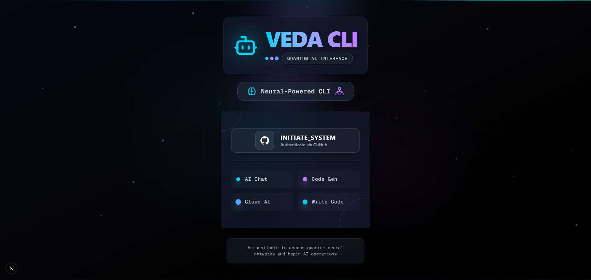
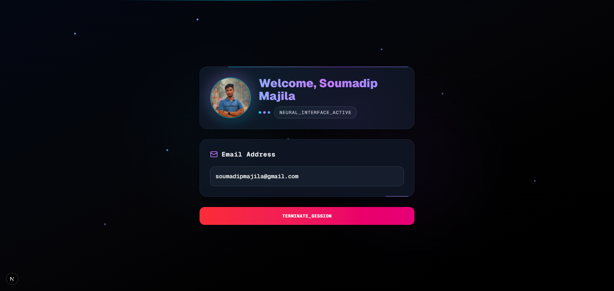

<h1 align="center">
  <br>
  VedaCLI 🤖
  <br>
</h1>

<p align="center">
  An AI-powered command-line interface built on Gemini.
</p>

<table align="center">
  <tr>
    <td align="center">
      
    </td>
    <td align="center">
      
    </td>
  </tr>
</table>

## 🌟 Features

## ⚙️ Tech Stack

- **🎨 Frontend**: React, Nextjs
- **🛠 Backend**: Node.js, Express.js, BetterAuth
- **🗄 Database**: Postgres, Prisma

## 📦 Installation

### 1. Clone and setup

```bash
git clone https://github.com/soumadip-dev/VedaCLI-MERN.git
cd VedaCLI-MERN
```

### 2. Frontend setup

```bash
cd client
npm install
```

### 3. Backend setup

```bash
cd server
npm install

# Make CLI executable and create global symlink
npm run dev:link

# Test the CLI
veda --version
```

#### Available Scripts in backend

| Script             | Purpose               |
| ------------------ | --------------------- |
| `npm start`        | Run main application  |
| `npm run dev`      | Run with auto-reload  |
| `npm run cli`      | Test CLI locally      |
| `npm run dev:link` | Setup global CLI link |

### Usage

After installation, you can use the `veda` command globally:

```bash
veda --help
veda --version
```
