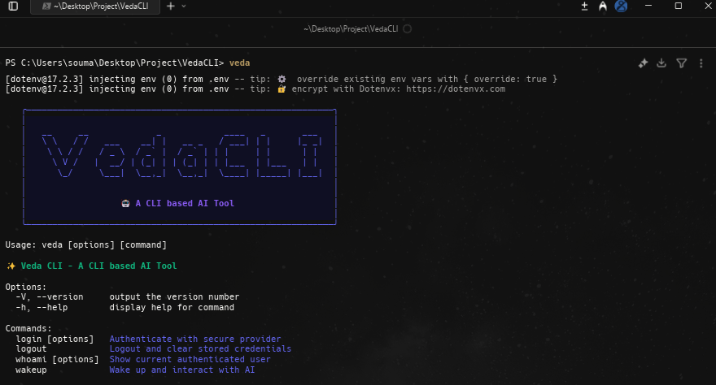
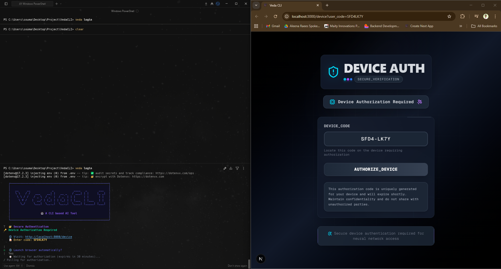
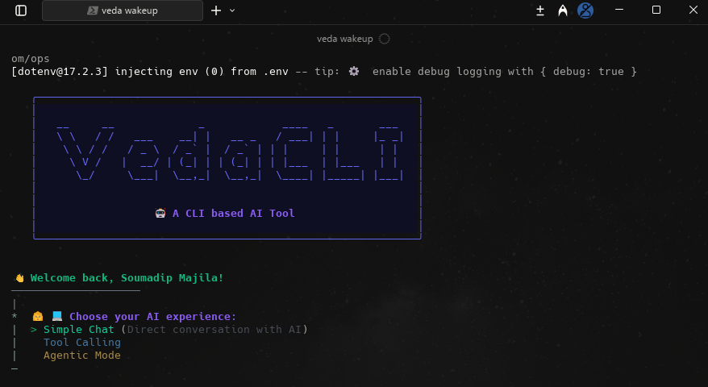
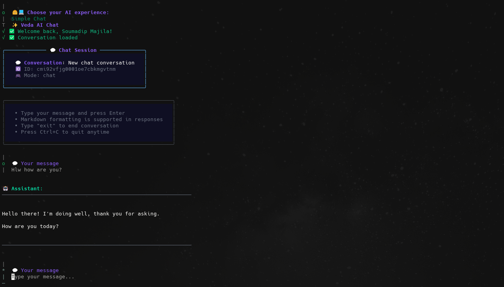
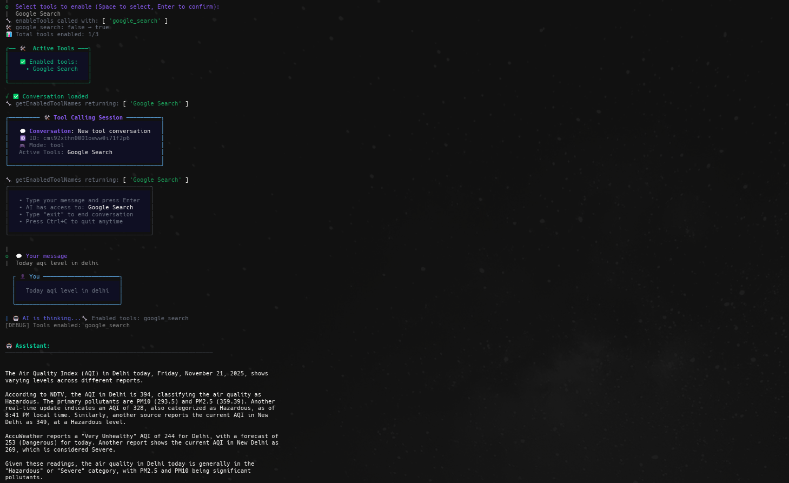

<h1 align="center">
  <br>
  VedaCLI 🤖
  <br>
</h1>

<p align="center">
  An AI-powered command-line interface built on Gemini.
</p>

<table align="center">
  <tr>
    <td align="center">
      
    </td>
    <td align="center">
      
    </td>
    <td align="center">
      
    </td>
  </tr>
  <tr>
    <td align="center">
      
    </td>
    <td align="center">
      
    </td>
    <td align="center">
      
    </td>
  </tr>
</table>

## 🌟 Features

- **Device Authorization** using GitHub OAuth
- **Simple Chat**: Direct conversation with AI
- **Tool Calling**: Enhanced chat with additional capabilities:
  - **Google Search**: Get latest data, useful content, news, and real-time information
  - **Code Execution**: Generate and execute Python code to perform calculations, solve problems, or provide accurate information
  - **URL Context**: Analyze specific URLs directly from the prompt (supports up to 20 URLs per request)
- **Agentic Mode**: Advanced AI agent (Currently in development)

## ⚙️ Tech Stack

- **🎨 Frontend**: React, Next.js
- **🛠 Backend**: Node.js, Express.js, BetterAuth
- **🗄 Database**: PostgreSQL, Prisma

## 📦 Installation

### 1. Clone and Setup

```bash
git clone https://github.com/soumadip-dev/VedaCLI-MERN.git
cd VedaCLI-MERN
```

### 2. Frontend Setup

```bash
cd client
npm install
```

### 3. Backend Setup

```bash
cd server
npm install

# Make CLI executable and create global symlink
npm run dev:link

# Test the CLI
veda --version
```

#### Available Scripts (Backend)

| Script             | Purpose               |
| ------------------ | --------------------- |
| `npm start`        | Run main application  |
| `npm run dev`      | Run with auto-reload  |
| `npm run cli`      | Test CLI locally      |
| `npm run dev:link` | Setup global CLI link |

## Usage

After installation, you can use the `veda` command globally:

```bash
veda --help    # Show help
veda --version # Show version
veda login     # Login to your account
veda wakeup    # Wake up the AI
```

---

## CLI Dependencies Overview

### 1. Boxen

Used to add **formatted boxes** around text in the CLI for better visual presentation.

### 2. Chalk

Used for **coloring and styling text** in the terminal output.

### 3. Figlet

Converts normal text into **decorative ASCII art banners**.

### 4. Inquirer

Helps create **interactive command-line prompts** for user input.

### 5. Ora

Used to display a **spinner or loading indicator** in the terminal.
