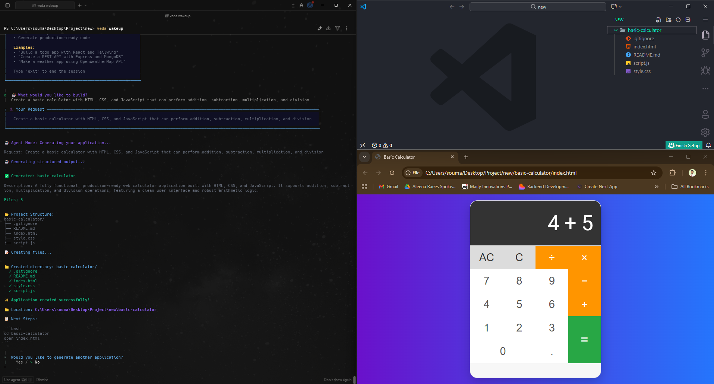

<h1 align="center">
  <br>
  VedaCLI 🤖
  <br>
</h1>

<p align="center">
  An intelligent command-line interface powered by Google's Gemini, bringing AI capabilities directly to your terminal.
</p>

<table align="center">
  <tr>
    <td align="center">
      
    </td>
    <td align="center">
      
    </td>
    <td align="center">
      
    </td>
  </tr>
  <tr>
    <td align="center">
      
    </td>
    <td align="center">
      
    </td>
    <td align="center">
      
    </td>
  </tr>
</table>

---

## 🎬 Demo Video

[VedaCli](https://www.linkedin.com/posts/soumadip-majila-dgp_just-built-vedacli-an-ai-powered-command-line-activity-7399306793140502528-OsY0?utm_source=social_share_send&utm_medium=member_desktop_web&rcm=ACoAAD1aMJQBxnv5DdAHrtZuCweFePs_SWP_DFE)

## 🔋 Features

- **🔐 Device Authorization** – Using GitHub OAuth for secure authentication
- **💬 Simple Chat** – Direct conversation with AI through your terminal
- **🛠️ Tool Calling** – Enhanced chat with additional capabilities:
  - **🔍 Google Search** – Get latest data, useful content, news, and real-time information
  - **💻 Code Execution** – Generate and execute Python code to perform calculations, solve problems, or provide accurate information
  - **🌐 URL Context** – Analyze specific URLs directly from the prompt (supports up to 20 URLs per request)
- **🤖 Agent Mode** – Advanced AI agent to create applications using structured output

## ⚙️ Tech Stack

- **🎨 Frontend**: React, Next.js
- **🛠 Backend**: Node.js, Express.js, BetterAuth
- **🗄 Database**: PostgreSQL, Prisma

## 🤸 Installation

### 1. Clone and Setup

```bash
git clone https://github.com/soumadip-dev/VedaCLI.git
cd VedaCLI
```

### 2. Frontend Setup

```bash
cd client
npm install
```

Create `.env.local` in the `client` directory:

```env
NEXT_PUBLIC_AUTH_BASE_URL=<your_backend_url>
```

### 3. Backend Setup

```bash
cd server
npm install
```

Create `.env` in the `server` directory:

```env
# Google Gemini API (Get from aisdk.com)
GOOGLE_GENERATIVE_AI_API_KEY=<your_google_gemini_api_key>
ORBITAI_MODEL=gemini-2.5-flash

# Server Configuration
PORT=<your_port_number>
NODE_ENV=development

# Database
DATABASE_URL=<your_postgresql_database_url>

# Better Auth
BETTER_AUTH_SECRET=<your_better_auth_secret>
BETTER_AUTH_URL=<your_backend_url>

# GitHub OAuth
GITHUB_CLIENT_ID=<your_github_oauth_client_id>
GITHUB_CLIENT_SECRET=<your_github_oauth_client_secret>

# URL Configuration
FRONTEND_URL=<your_frontend_url>
BASE_URL=<your_backend_url>
```

### 4. CLI Setup

Inside the `server` directory:

```bash
# Make CLI executable and create global symlink
npm run dev:link

# Test the CLI
veda --version
```

#### Available Scripts (Backend)

| Script             | Purpose               |
| ------------------ | --------------------- |
| `npm start`        | Run main application  |
| `npm run dev`      | Run with auto-reload  |
| `npm run cli`      | Test CLI locally      |
| `npm run dev:link` | Setup global CLI link |

## 💻 Usage

After installation, you can use the `veda` command globally:

```bash
veda --help    # Show help
veda --version # Show version
veda login     # Login to your account
veda wakeup    # Wake up the AI
```

---
